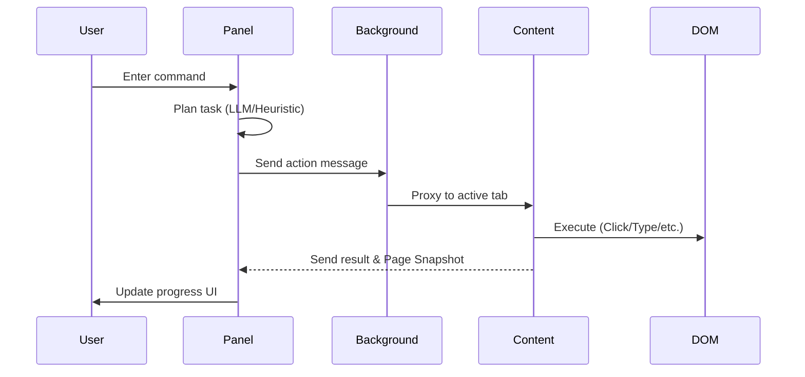

# ARIA Technical Documentation
## Autonomous Responsive Intelligent Agent

ARIA is a sophisticated Chrome Extension designed for high-performance web automation powered by Artificial Intelligence. It bridges the gap between natural language intent and browser-level execution, allowing users to automate complex web workflows with simple commands.

---

## 🏗️ System Architecture

ARIA follows a robust **Three-Layer Architecture** designed for modularity, reliability, and AI integration.

### 1. UI Layer (Side Panel)
*   **Entry Point**: `src/panel.ts` / `src/panel.html`
*   **Purpose**: Manages user interaction, task input, and real-time progress visualization.
*   **Key Features**:
    *   Natural language task input.
    *   Live execution logs and step-by-step progress tracking.
    *   Settings for LLM configuration (Cloud vs. Local/Ollama).
    *   Specialized UI for form-filling review and summarization results.

### 2. Intelligence Layer (Task Planning)
*   **Entry Point**: `src/shared/llmClient.ts` & `src/shared/taskClassifier.ts`
*   **Purpose**: Translates human intent into structured browser actions.
*   **Strategies**:
    *   **Heuristic Mode**: Uses pre-defined, optimized patterns for popular sites like YouTube and Amazon for maximum speed.
    *   **LLM Mode**: Uses AI (e.g., Qwen 2.5, Llama 3) to analyze the current DOM snapshot and generate adaptive action plans.
    *   **Agent Loop**: A multi-turn "Observe-Plan-Act" cycle that allows the agent to recover from errors and handle dynamic page changes.
    *   **Task Classifier**: Automatically routes tasks to specialized workflows (Form Filling, Summarization, Data Extraction).

### 3. Execution Layer (Web Interaction)
*   **Entry Point**: `src/content.ts`
*   **Purpose**: Directly interacts with the browser's Document Object Model (DOM).
*   **Innovations**:
    *   **Multi-Strategy Element Detection**: Cascadings through Semantic, Text, Proximity, and LLM-generated selectors to find elements with 95% accuracy.
    *   **Network-Idle Detection**: A Playwright-inspired system that hooks `fetch` and monitors `MutationObserver` to ensure the page is actually "ready" before interacting.
    *   **Shadow DOM Support**: Deep traversal algorithms that work with modern web components and frameworks (React, Vue, etc.).
    *   **Stealth Mode**: Injected scripts in `src/stealth-inject.ts` to help bypass common anti-bot protections.

---

## 📂 Project Structure

```text
root/
├── src/                    # Extension Core Logic
│   ├── background.ts       # Service worker (message routing)
│   ├── content.ts          # Content script (DOM interaction)
│   ├── manifest.ts         # Extension configuration (MV3)
│   ├── panel.ts            # Side panel logic (The "Brain")
│   ├── shared/             # Common utilities
│   │   ├── llmClient.ts    # AI integration logic
│   │   ├── storage.ts      # Chrome Storage management
│   │   └── types.ts        # TypeScript interfaces
│   └── workflows/          # Specialized task modules
│       ├── formFilling.ts
│       ├── dataExtraction.ts
│       └── summarization.ts
├── creator-dashboard/      # React-based Monitoring App
│   ├── src/                # React components & hooks
│   ├── tailwind.config.js  # Styling configuration
│   └── vite.config.ts      # Dashboard build setup
├── benchmarks/             # Performance testing suits
└── tests/                  # Automated integration tests
```

---

## 🚀 Key Innovations & Features

### 🧩 4-Strategy Element Finder
1.  **Semantic**: Matches HTML attributes (aria-label, placeholder, role).
2.  **Text**: Finds elements by visible text or button labels.
3.  **Proximity**: Locates inputs near descriptive labels or headers.
4.  **LLM Selector**: As a last resort, sends a DOM fragment to the AI to generate a precise CSS selector.

### ⏱️ Smart Page Readiness
Unlike traditional tools that only check `document.readyState`, ARIA waits for:
*   **Network Idle**: No active `fetch` or `XHR` requests.
*   **DOM Stability**: No significant mutations for >500ms.
*   The system ensures interacting with modern Single Page Applications (SPAs) is robust and error-free.

### 🧠 Recursive Task Memory
Located in `src/shared/storage.ts` and `taskMatcher.ts`, ARIA generates **fingerprints** of successful tasks. If a user asks for a similar task on the same domain, ARIA can "replay" the successful pattern, reducing LLM costs and increasing speed.

### 📊 Creator Dashboard
A companion web application (`creator-dashboard`) that provides:
*   Real-time performance analytics.
*   Success/Failure stats per domain.
*   Recent task history and patterns.
*   UI built with modern Samsung Design Language aesthetics.

---

## 🛠️ Technology Stack
*   **Language**: TypeScript (Type safety throughout the app).
*   **Build Tool**: Vite (Extremely fast HMR and optimized builds).
*   **Frameworks**: React (Dashboard), Vanilla TS (Extension Core), Tailwind CSS (Aesthetics).
*   **AI**: OpenAI-compatible API support (supports OpenRouter, Ollama, vLLM).
*   **License**: Built with open-source tools (Apache 2.0 / MIT compatible).

---

## 📞 Key Logic Flows

### Message Passing


### Self-Healing Loop
If an element is not found during execution:
1.  Content script attempts **Fuzzy Selector** matching (Partial IDs/Classes).
2.  If still fails, it triggers **Modal Dismissal** logic (to clear popups).
3.  As a final fallback, it asks the LLM for a new selector based on a current snapshot.
