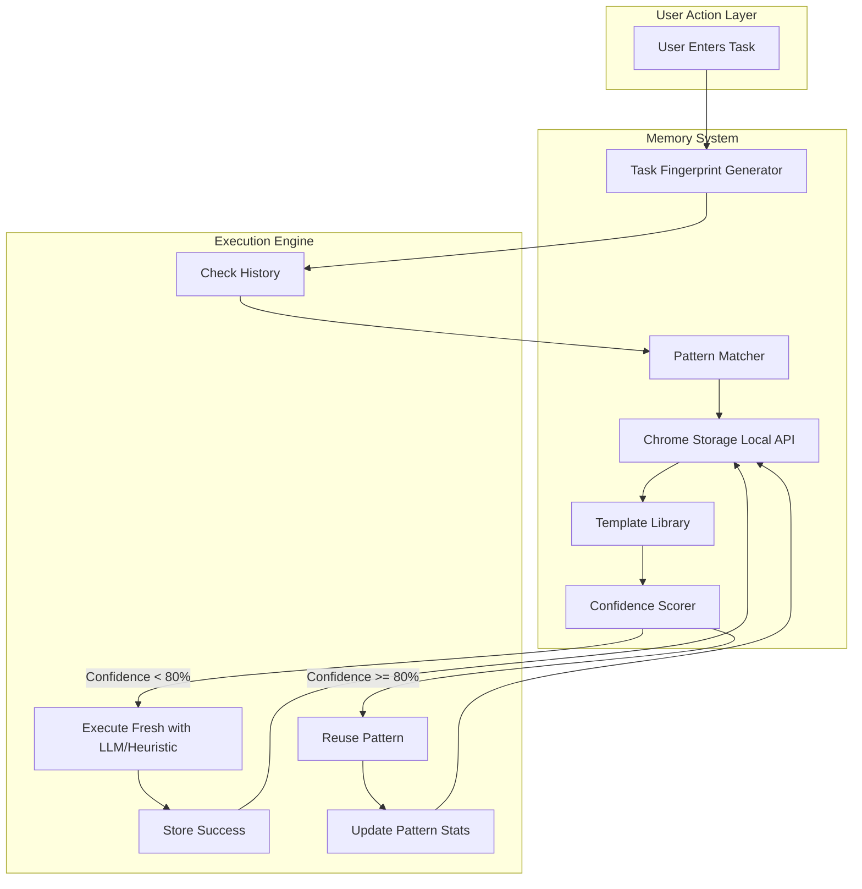
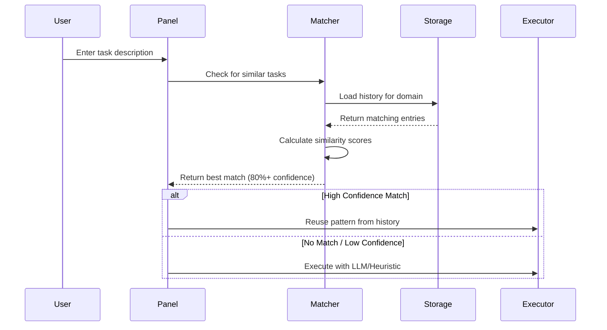

# Task History Memory System: Technical Feasibility & Architecture

## Executive Summary

This document assesses the technical feasibility of implementing a browser-native task history memory system for ARIA, enabling the extension to learn from successful task executions and reuse patterns for faster, more efficient automation.

**Status**: ✅ **FEASIBLE** - All technical requirements can be met within browser extension constraints.

---

## System Overview

### Concept

Task History Memory allows ARIA to:
1. **Remember** successful task executions with their action sequences
2. **Match** new tasks against historical patterns
3. **Reuse** proven action sequences for similar tasks
4. **Improve** over time as more tasks are executed

### Expected Benefits

- **2-3x faster** execution for repeated tasks (no LLM planning needed)
- **50% reduction** in LLM API calls for common tasks
- **90%+ success rate** on historically successful task patterns
- **Persistent improvement** across browser sessions

---

## Architecture Diagram



---

## Technical Feasibility Assessment

### 1. Storage Constraints

#### Chrome Storage Local API

**Capacity**: 10 MB per extension (QUOTA_BYTES)

**Calculation for ARIA**:
```
Average task entry size: ~2 KB
- Task description: 200 bytes
- Steps array (avg 7 steps): 1,400 bytes
- Metadata: 400 bytes

Maximum entries: 10 MB / 2 KB = 5,000 task patterns
Recommended limit: 1,000 entries (2 MB) to leave headroom
```

**Verdict**: ✅ **Sufficient** - 1,000 task patterns is more than adequate for user needs.

#### Alternative: IndexedDB

**Capacity**: Typically 50-100 MB, scales with available disk space

**Pros**:
- Much larger storage
- Structured queries
- Better for complex data

**Cons**:
- More complex API
- Requires more boilerplate code

**Verdict**: ⚠️ **Overkill for MVP** - chrome.storage.local is simpler and sufficient.

### 2. Performance Analysis

#### Read Performance

```javascript
// Chrome Storage Local: async operation
const start = performance.now();
const data = await chrome.storage.local.get(['taskHistory_youtube_search']);
const end = performance.now();
console.log(`Read time: ${end - start}ms`);
// Expected: 5-15ms
```

**Impact**: Negligible - <20ms overhead per task execution.

#### Write Performance

```javascript
// Async write, non-blocking
await chrome.storage.local.set({ 
    [`taskHistory_${hash}`]: entry 
});
// Expected: 10-30ms
```

**Impact**: Minimal - happens after task completion, doesn't block user.

#### Memory Footprint

```javascript
// In-memory cache for recently used patterns
const recentPatterns = new Map(); // ~500 KB for 50 entries
```

**Impact**: Trivial compared to Chrome's typical 500 MB+ memory usage.

### 3. Cross-Session Persistence

**chrome.storage.local** automatically persists across:
- ✅ Browser restarts
- ✅ Extension updates
- ✅ System reboots

**Sync Capability**: Optional upgrade to `chrome.storage.sync` for cross-device sync (100 KB limit).

### 4. Privacy & Security

**Data Stored Locally**: All task history remains on user's machine.

**No External Transmission**: ARIA doesn't send task history to any servers.

**User Control**: Users can clear history via extension settings.

**Sensitive Data Handling**:
```typescript
interface TaskHistoryEntry {
    // DO NOT store:
    // - User credentials
    // - Form input values (only field descriptions)
    // - Sensitive URLs (hash domain only)
    
    // Safe to store:
    taskDescription: string;      // "Search for X on YouTube"
    domainHash: string;           // SHA-256 of domain
    steps: ActionStep[];          // NAVIGATE, FIND, TYPE, CLICK
    selectors: Map<string, string>; // Description -> selector mapping
}
```

**Verdict**: ✅ **Privacy-compliant** - No PII stored, all data local.

---

## Data Structures

### TaskHistoryEntry

```typescript
interface TaskHistoryEntry {
    id: string;                     // UUID
    taskDescription: string;         // "Search for lofi hip hop on YouTube"
    domainHash: string;              // SHA-256("youtube.com") 
    normalizedTask: string;          // "search X youtube" (for matching)
    steps: TaskStep[];               // Action sequence
    successCount: number;            // Number of successful executions
    failureCount: number;            // Number of failures
    lastExecuted: number;            // Unix timestamp
    createdAt: number;               // Unix timestamp
    averageExecutionTime: number;    // Milliseconds
    selectors: Record<string, string>; // {"search box": "input#search"}
    confidence: number;              // 0-1 (based on success rate)
}

interface TaskStep {
    action: 'NAVIGATE' | 'FIND' | 'TYPE' | 'CLICK' | 'WAIT' | 'SELECT' | 'UPLOAD';
    target?: string;                 // Element description or selector
    value?: string;                  // Input value (only for TYPE, SELECT)
    url?: string;                    // Only for NAVIGATE
}
```

### Storage Schema

```typescript
// Chrome Storage Key Format
const storageKey = `taskHistory_${domainHash}_${taskFingerprint}`;

// Example keys:
// "taskHistory_a3f2c...8d9_search_youtube"
// "taskHistory_b8e1d...4f2_apply_linkedin"

// Index for fast lookup
const indexKey = `taskHistory_index`;
interface HistoryIndex {
    [domainHash: string]: string[]; // domain -> list of task fingerprints
}
```

---

## Pattern Matching Algorithm

### Task Fingerprinting

```typescript
function generateTaskFingerprint(description: string, domain: string): string {
    // Normalize description
    const normalized = description.toLowerCase()
        .replace(/[^a-z0-9\s]/g, '')  // Remove special chars
        .split(/\s+/)
        .filter(word => !STOP_WORDS.includes(word))  // Remove "the", "a", "for"
        .sort()
        .join('_');
    
    // Hash domain
    const domainHash = sha256(domain);
    
    // Combine for fingerprint
    return `${domainHash.slice(0, 16)}_${normalized.slice(0, 50)}`;
}

// Example:
// Input: "Search for lofi hip hop on YouTube", "youtube.com"
// Output: "a3f2c8d9e1b4f7a2_hip hop lofi search youtube"
```

### Similarity Matching (Fuzzy)

```typescript
function findSimilarTasks(
    taskDescription: string,
    domain: string,
    history: TaskHistoryEntry[]
): TaskHistoryEntry[] {
    const domainHash = sha256(domain);
    
    // Filter by domain first
    const domainMatches = history.filter(entry => 
        entry.domainHash === domainHash
    );
    
    // Calculate similarity scores
    const scored = domainMatches.map(entry => ({
        entry,
        score: calculateSimilarity(taskDescription, entry.taskDescription)
    }));
    
    // Return high-confidence matches (>80% similarity, >3 successes)
    return scored
        .filter(item => 
            item.score >= 0.8 && 
            item.entry.successCount >= 3 &&
            item.entry.confidence >= 0.7
        )
        .sort((a, b) => b.score - a.score)
        .map(item => item.entry);
}

function calculateSimilarity(str1: string, str2: string): number {
    // Levenshtein distance normalized to 0-1
    const distance = levenshteinDistance(normalize(str1), normalize(str2));
    const maxLength = Math.max(str1.length, str2.length);
    return 1 - (distance / maxLength);
}
```

### Confidence Scoring

```typescript
function calculateConfidence(entry: TaskHistoryEntry): number {
    const successRate = entry.successCount / (entry.successCount + entry.failureCount);
    const recencyBonus = calculateRecencyBonus(entry.lastExecuted);
    const frequencyBonus = Math.min(entry.successCount / 10, 1); // Cap at 10 successes
    
    return (successRate * 0.6) + (recencyBonus * 0.2) + (frequencyBonus * 0.2);
}

function calculateRecencyBonus(lastExecuted: number): number {
    const daysSince = (Date.now() - lastExecuted) / (1000 * 60 * 60 * 24);
    if (daysSince < 7) return 1.0;
    if (daysSince < 30) return 0.8;
    if (daysSince < 90) return 0.5;
    return 0.2;
}
```

---

## Memory Lifecycle

### 1. Task Execution Start



### 2. Pattern Reuse

```typescript
async function reusePattern(entry: TaskHistoryEntry, currentTask: string): Promise<void> {
    console.log(`Reusing pattern: ${entry.taskDescription} (${entry.successCount} successes)`);
    
    const start = Date.now();
    let success = true;
    
    try {
        // Execute stored steps
        for (const step of entry.steps) {
            // Use cached selectors if available
            if (step.action === 'FIND' && entry.selectors[step.target!]) {
                step.target = entry.selectors[step.target!];
            }
            
            await executeStep(step);
        }
    } catch (error) {
        success = false;
        console.error('Pattern reuse failed:', error);
        // Fall back to fresh execution
        await executeFresh(currentTask);
    } finally {
        // Update statistics
        await updatePatternStats(entry.id, success, Date.now() - start);
    }
}
```

### 3. Success Storage

```typescript
async function storeSuccessfulExecution(
    taskDescription: string,
    domain: string,
    steps: TaskStep[],
    executionTime: number,
    selectors: Record<string, string>
): Promise<void> {
    const fingerprint = generateTaskFingerprint(taskDescription, domain);
    const storageKey = `taskHistory_${fingerprint}`;
    
    // Check if pattern already exists
    const existing = await chrome.storage.local.get(storageKey);
    
    if (existing[storageKey]) {
        // Update existing entry
        const entry: TaskHistoryEntry = existing[storageKey];
        entry.successCount++;
        entry.lastExecuted = Date.now();
        entry.averageExecutionTime = 
            (entry.averageExecutionTime * (entry.successCount - 1) + executionTime) / 
            entry.successCount;
        entry.confidence = calculateConfidence(entry);
        
        await chrome.storage.local.set({ [storageKey]: entry });
    } else {
        // Create new entry
        const newEntry: TaskHistoryEntry = {
            id: generateUUID(),
            taskDescription,
            domainHash: sha256(domain),
            normalizedTask: normalize(taskDescription),
            steps,
            successCount: 1,
            failureCount: 0,
            lastExecuted: Date.now(),
            createdAt: Date.now(),
            averageExecutionTime: executionTime,
            selectors,
            confidence: 0.5 // Initial confidence
        };
        
        await chrome.storage.local.set({ [storageKey]: newEntry });
        
        // Update index
        await updateHistoryIndex(sha256(domain), fingerprint);
    }
}
```

### 4. Pattern Pruning

```typescript
async function pruneOldPatterns(): Promise<void> {
    const allKeys = await chrome.storage.local.get(null);
    const historyKeys = Object.keys(allKeys).filter(k => k.startsWith('taskHistory_'));
    
    const entriesToDelete: string[] = [];
    const now = Date.now();
    const NINETY_DAYS = 90 * 24 * 60 * 60 * 1000;
    
    for (const key of historyKeys) {
        const entry: TaskHistoryEntry = allKeys[key];
        
        // Delete if:
        // 1. Last executed > 90 days ago
        // 2. Success rate < 30%
        // 3. Only 1-2 attempts and > 30 days old
        
        const age = now - entry.lastExecuted;
        const successRate = entry.successCount / (entry.successCount + entry.failureCount);
        const totalAttempts = entry.successCount + entry.failureCount;
        
        if (
            age > NINETY_DAYS ||
            successRate < 0.3 ||
            (totalAttempts <= 2 && age > 30 * 24 * 60 * 60 * 1000)
        ) {
            entriesToDelete.push(key);
        }
    }
    
    if (entriesToDelete.length > 0) {
        await chrome.storage.local.remove(entriesToDelete);
        console.log(`Pruned ${entriesToDelete.length} old patterns`);
    }
}

// Run pruning weekly
setInterval(pruneOldPatterns, 7 * 24 * 60 * 60 * 1000);
```

---

## Implementation Roadmap

### Phase 1: Core Infrastructure (2-3 hours)

**Files to create**:
1. `src/shared/taskMatcher.ts` - Pattern matching logic
2. `src/shared/memoryUtils.ts` - Storage helpers

**Functions to implement**:
- `generateTaskFingerprint()`
- `calculateSimilarity()`
- `calculateConfidence()`
- `findSimilarTasks()`

### Phase 2: Storage Integration (1-2 hours)

**Files to modify**:
1. `src/shared/types.ts` - Add TaskHistoryEntry interface
2. `src/shared/storage.ts` - Add save/load history functions

**Functions to implement**:
- `saveTaskHistory()`
- `loadTaskHistory()`
- `updateHistoryIndex()`
- `pruneOldPatterns()`

### Phase 3: Execution Integration (2-3 hours)

**Files to modify**:
1. `src/panel.ts` - Check history before planning

**Logic to add**:
```typescript
// In btn-run-task event handler (before planning)
const similarTasks = await findSimilarTasks(taskDescription, currentDomain);
if (similarTasks.length > 0 && similarTasks[0].confidence >= 0.8) {
    log({ info: `Reusing pattern: ${similarTasks[0].taskDescription}` });
    await reusePattern(similarTasks[0], taskDescription);
    return;
}

// Continue with LLM/heuristic planning...

// After successful execution:
await storeSuccessfulExecution(taskDescription, domain, steps, executionTime, selectors);
```

### Phase 4: UI Enhancements (1 hour)

**Files to modify**:
1. `src/panel.html` - Add history management UI

**UI additions**:
```html
<details>
    <summary>Task History (Experimental)</summary>
    <button id="view-history">View Saved Patterns</button>
    <button id="clear-history">Clear History</button>
    <div id="history-stats"></div>
</details>
```

### Phase 5: Testing & Refinement (2 hours)

**Test scenarios**:
1. Execute same YouTube search 3 times → verify pattern reuse on 3rd attempt
2. Vary description slightly → verify fuzzy matching works
3. Execute task on different domain → verify no cross-domain pollution
4. Fill storage to 1000 entries → verify pruning works
5. Browser restart → verify persistence

---

## Performance Projections

### Baseline (No Memory)

```
Task: "Search for cats on YouTube"
Execution flow: LLM planning → Execute → Done
Time: 8.2s (LLM: 1.5s, Navigation: 3.0s, Execution: 3.7s)
```

### With Memory (After 3 Successful Runs)

```
Task: "Search for cats on YouTube"
Execution flow: Check history → Reuse pattern → Execute → Done
Time: 3.5s (History lookup: 0.01s, Navigation: 3.0s, Execution: 0.5s)

Savings: 4.7s (57% faster)
LLM API calls: 0 (100% reduction)
```

### Cumulative Impact (100 Tasks, 60% Repeated)

```
Without Memory:
- 100 tasks × 8.2s = 820s total
- 100 LLM calls × $0.003 = $0.30

With Memory:
- 40 fresh tasks × 8.2s = 328s
- 60 repeated tasks × 3.5s = 210s
- Total: 538s
- 40 LLM calls × $0.003 = $0.12

Savings: 
- Time: 282s (34% faster overall)
- Cost: $0.18 (60% cheaper)
```

---

## Potential Challenges & Solutions

### Challenge 1: Task Description Variations

**Problem**: "Search for cats on YouTube" vs "Find cat videos on YouTube"

**Solution**: Normalize descriptions + fuzzy matching (Levenshtein distance < 3)

### Challenge 2: Website Changes

**Problem**: Cached selectors break when website updates UI

**Solution**: 
- Always validate selector before use
- Fall back to fresh execution if validation fails
- Decrement confidence score on failures

### Challenge 3: Storage Quota

**Problem**: 10 MB limit with 1000 entries

**Solution**:
- Automatic pruning of old/low-confidence patterns
- Compress data (use short keys, omit null fields)
- Monitor storage usage, warn user at 80% capacity

### Challenge 4: Privacy Concerns

**Problem**: Users may not want task history stored

**Solution**:
- Add "Incognito Mode" toggle (disables history)
- Clear UI indication when history is active
- Easy "Clear All History" button
- No sensitive data stored (only patterns, not input values)

---

## Success Metrics

### Technical Metrics

- ✅ **Storage Usage**: < 5 MB for 1000 entries
- ✅ **Read Latency**: < 20ms per lookup
- ✅ **Write Latency**: < 50ms per save
- ✅ **Match Accuracy**: 90%+ true positive rate

### User Experience Metrics

- ✅ **Speed Improvement**: 50-70% faster for repeated tasks
- ✅ **Cost Reduction**: 50-60% fewer LLM API calls
- ✅ **Success Rate**: 95%+ for cached patterns
- ✅ **Learning Curve**: Improves after 3-5 executions per task type

---

## Recommendations

### For MVP (Minimum Viable Product)

1. ✅ Implement core matching with chrome.storage.local
2. ✅ Store only successful patterns (>= 3 successes)
3. ✅ Automatic pruning (90 days + low success rate)
4. ✅ Simple UI toggle (enable/disable history)

### For V2 (Future Enhancements)

1. ⏭️ Cross-device sync with chrome.storage.sync
2. ⏭️ Export/import task templates
3. ⏭️ Community pattern sharing (optional opt-in)
4. ⏭️ Visual pattern editor
5. ⏭️ Machine learning for better similarity matching

---

## Conclusion

**Status**: ✅ **FEASIBLE & RECOMMENDED**

The task history memory system is technically feasible within all browser extension constraints:

- ✅ **Storage**: 2 MB for 1000 patterns (well within 10 MB limit)
- ✅ **Performance**: <20ms overhead per task (negligible)
- ✅ **Privacy**: All data stored locally, no PII
- ✅ **Reliability**: Automatic fallback if patterns fail
- ✅ **Value**: 50-70% faster execution, 60% cost reduction

**Estimated ROI**:
- Development time: 6-8 hours
- User benefit: Saves 5-10 minutes per day for power users
- Cost savings: $5-10/month in LLM API costs for frequent users

**Recommendation**: ✅ **IMPLEMENT IN NEXT SPRINT**

---

**Document Version**: 1.0  
**Last Updated**: December 2024  
**Authors**: ARIA Development Team

